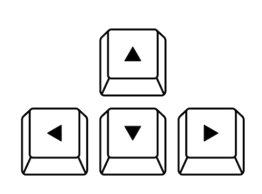

# Snake con pygame

El Snake es un videojuego lanzado a mediados de la década de 1970 por _Gremlin Noki_ que ha mantenido su popularidad desde entonces, convirtiéndose en un clásico. Se ha intentado replicar la lógica del juego tratando de mantener el aspecto recto y pixelado del original. 


## Índice
1. [Índice](Índice)
2. [Descargar](Descargar)
3. [Compilar](Compilar)
4. [Reglasdeljuego](Reglasdeljuego)
5. [Controles](Controles)

1. Clone el repositorio desde su bash en la ubicación en la que desea tenerlo:
```
git clone https://github.com/nachoperezzv/Snake.git
```

2. Cree el entorno virtual de python para no modificar sus bibliotecas personales y asegurarse de que se descarga la versión correcta de **pygame**. Puede hacerlo de la siguiente forma , estando en la misma ubicación que en el paso anterior:

```
python -m venv Snake
```

3. Acceda a la carpeta:
```
cd Snake
```

4. Deberá activar su entorno virtual. Por convención, con `venv` debería de disponer de un directorio de nombre `Scripts`. Acceda a el y luego ejecute el siguiente comando. 

    - Desde `cmd`:
    ```
    cd Scripts
    .\activate.bat
    ```

    - Desde `terminal` (linux):
    ```
    source \Scripts\.activate.bat
    ```

5. Una vez ha generado y activado su entorno virtual, instale los paquetes:

```
python install -r requirements.txt
```


## Compilar

Este dato es importante puesto que se debe compilar exclusivamente desde la carpeta `/src`. Si se hace desde la carpeta general de `/Snake` provocará un fallo. 

```
C:\Users\user\Snake\src\python main.py 
```

## Reglas del juego

1.  El usuario controla la dirección de la cabeza (arriba, abajo, izquierda o derecha).

2.  El cuerpo de la serpiente sigue a a la cabeza.

3.  El jugador no puede detener el movimiento de la serpiente mientras el juego está en marcha.

4.  La cabeza de la serpiente no puede salir de los límites del juego, si lo hace, muere.

5.  La cabeza de la serpiente no puede coincidir con ninguna de las posiciones de su cuerpo, si lo hace, muere.

## Controles

Los controles son básicos, se usan las flechas del ordenador para mover la cabeza de la serpiente.

